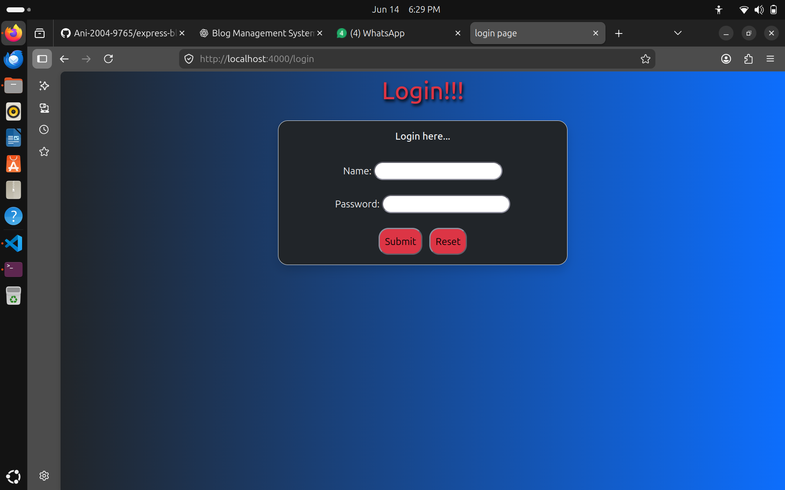
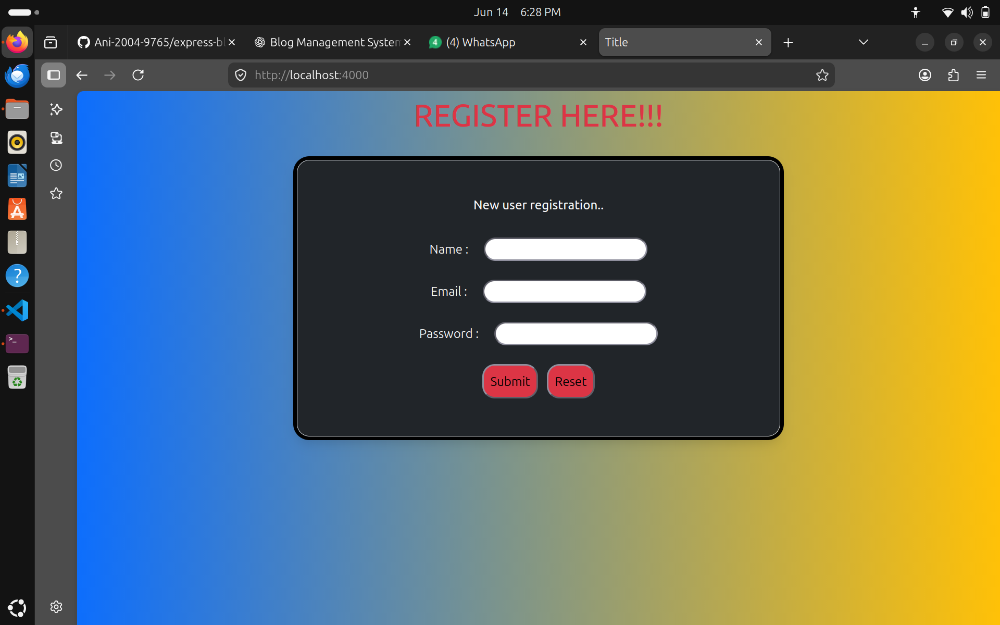
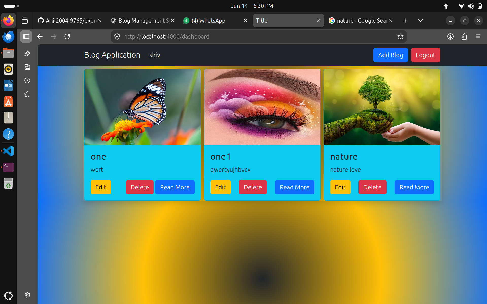
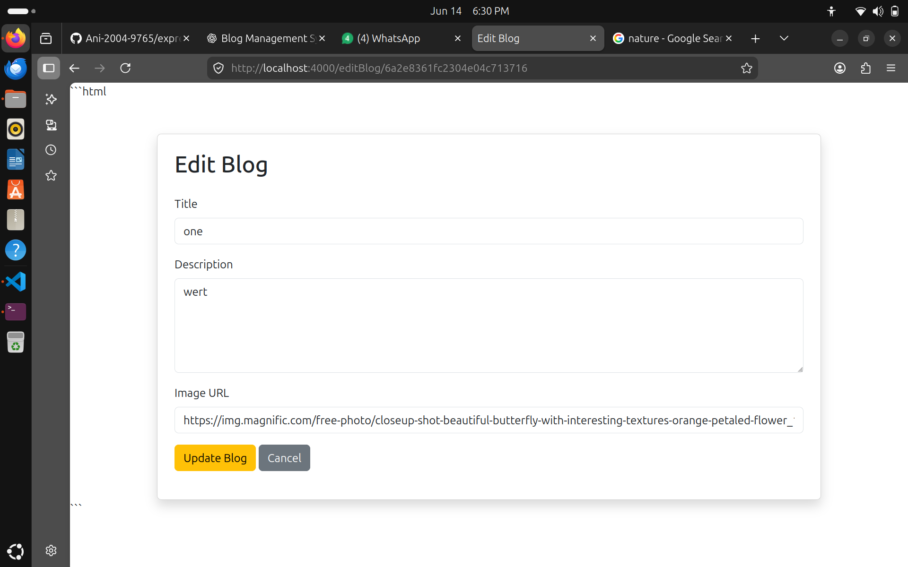
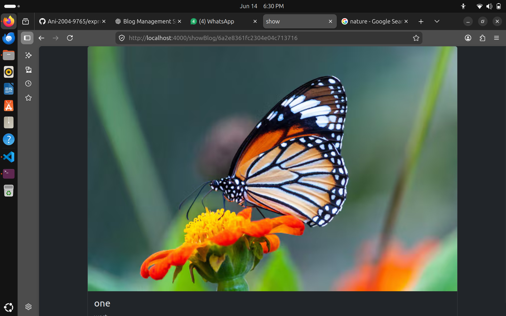
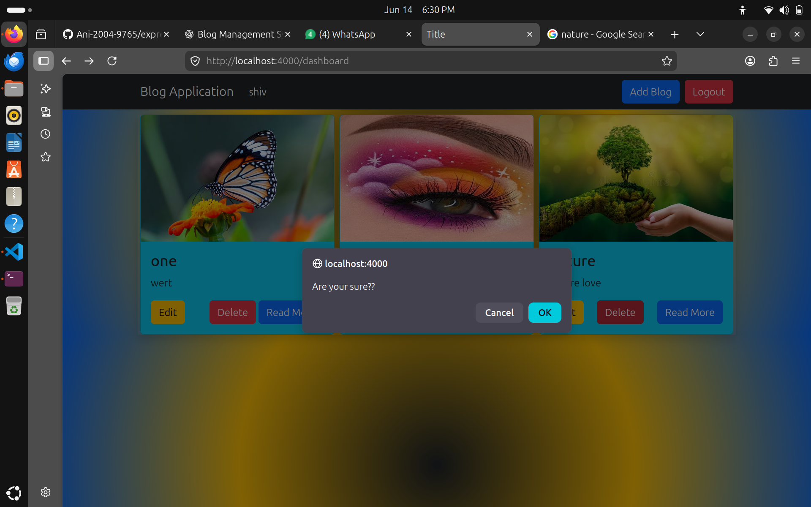
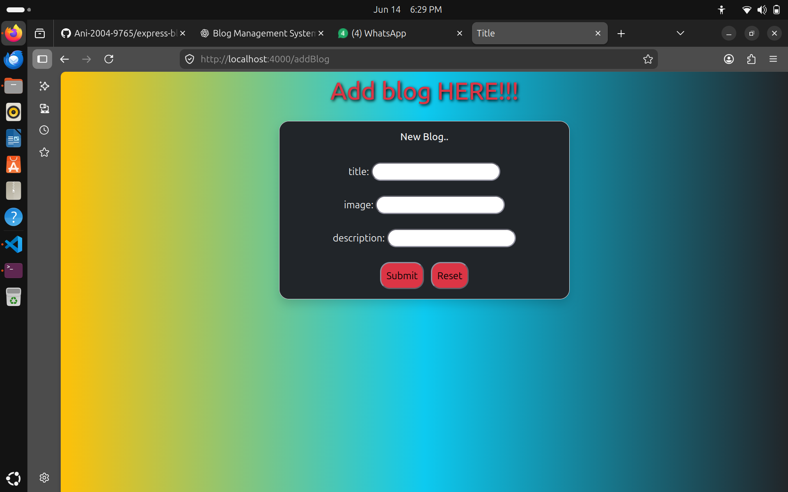

# Express Blog Management System

A simple Blog Management System built using Node.js, Express.js, MongoDB, EJS, and MVC architecture.

## Features

- User Registration
- User Login Authentication
- Password Hashing using bcrypt
- Session Management
- Create Blog Posts
- View Blog Details
- Edit Blog Posts
- Delete Blog Posts
- MongoDB Database Integration
- MVC Project Structure

## Technologies Used

- Node.js
- Express.js
- MongoDB
- Mongoose
- EJS
- Express Session
- bcryptjs
- Method Override

## Project Structure

##output images

